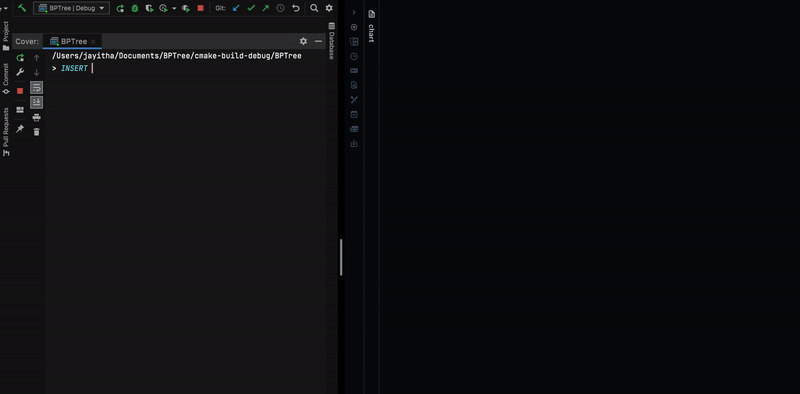

# BPTree

A B+Tree implementation in C++.


## Commands to run the code:
- Inside the folder run ```mkdir build```
- Then ```cd build```
- Then ```cmake ```. (if cmake not installed, install it first.)
- Then run ```make```
- Then ``` ./BPTree```
