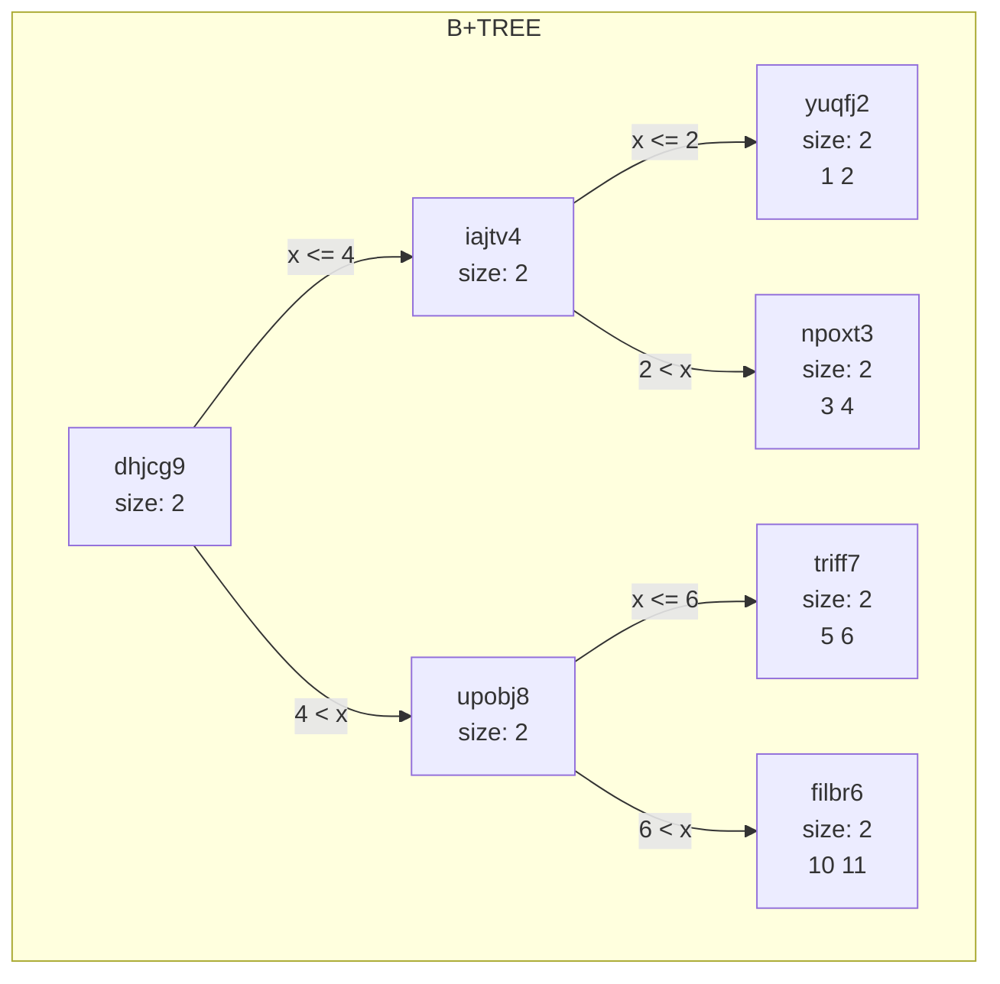
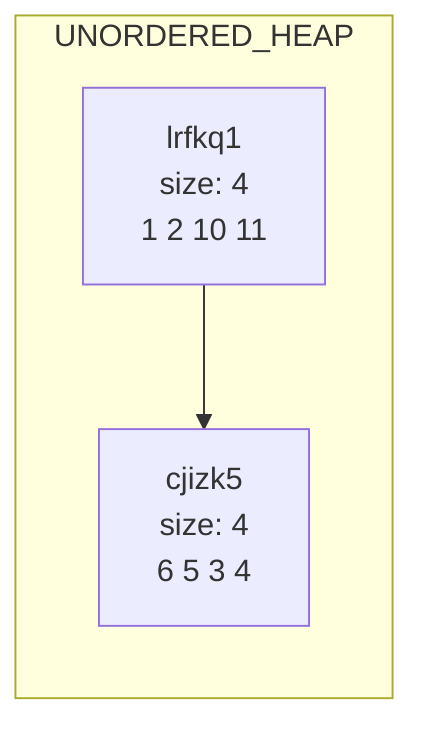

```mermaid
graph TD
subgraph B+TREE
dhjcg9[dhjcg9<br/>size: 2<br/>]
iajtv4[iajtv4<br/>size: 2<br/>]
yuqfj2[yuqfj2<br/>size: 2<br/>1 2 ]
iajtv4-->|x <= 2|yuqfj2
npoxt3[npoxt3<br/>size: 2<br/>3 4 ]
iajtv4-->|2 < x|npoxt3
dhjcg9-->|x <= 4|iajtv4
upobj8[upobj8<br/>size: 2<br/>]
triff7[triff7<br/>size: 2<br/>5 6 ]
upobj8-->|x <= 6|triff7
filbr6[filbr6<br/>size: 2<br/>10 11 ]
upobj8-->|6 < x|filbr6
dhjcg9-->|4 < x|upobj8
end
```

```mermaid
graph LR
subgraph UNORDERED_HEAP
lrfkq1[lrfkq1<br/>size: 4<br/>1 2 10 11 ]
cjizk5[cjizk5<br/>size: 4<br/>6 5 3 4 ]
lrfkq1-->cjizk5
end
```
